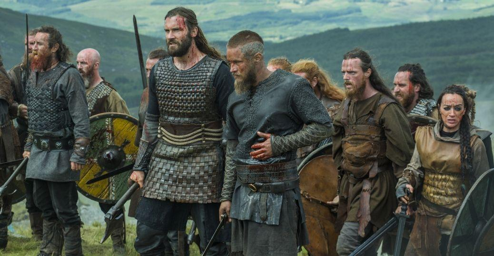
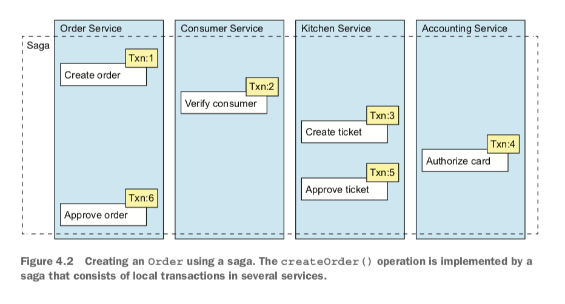
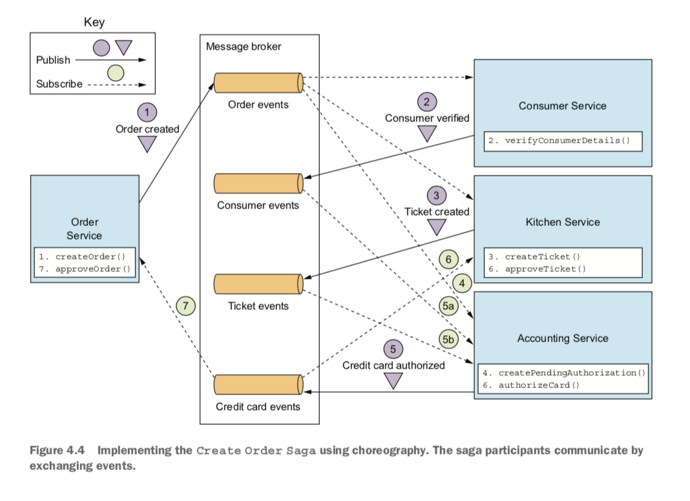
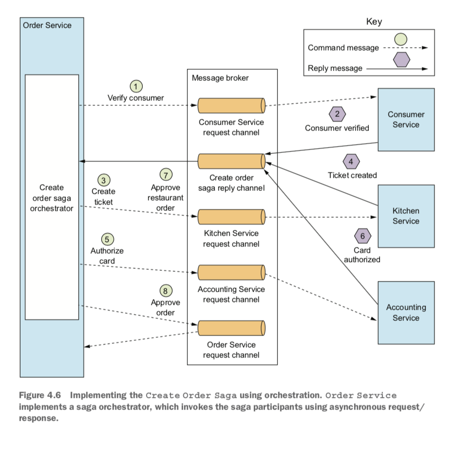
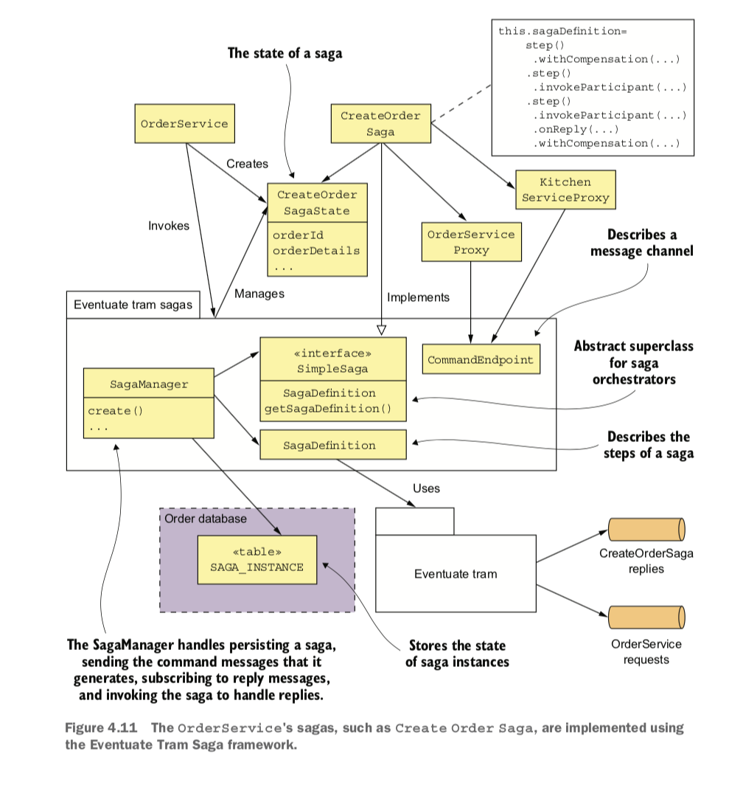
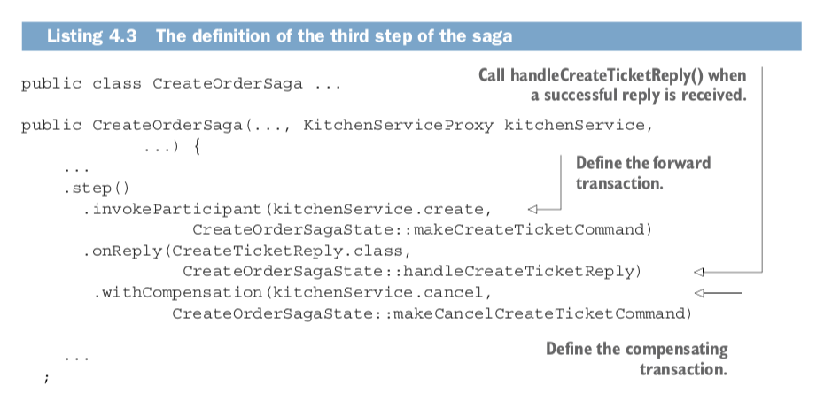

# Chapter 4: **_Managing transactions with sagas_**

* Why distributed transactions aren’t a good fit for modern applications

* Using the Saga pattern to maintain data consistency in a microservice architecture

* Coordinating sagas using choreography and orchestration

* Using countermeasures to deal with the lack of isolation

## Chapter Summary

* Some system operations need to update data scattered across multiple services. Traditional, XA/2PC-based distributed transactions aren’t a good fit for modern applications. A better approach is to use the Saga pattern. A saga is sequence of local transactions that are coordinated using messaging. Each local transaction updates data in a single service. Because each local transaction commits its changes, if a saga must roll back due to the violation of a business rule, it must execute compensating transactions to explicitly undo changes.

* You can use either choreography or orchestration to coordinate the steps of a saga. In a choreography-based saga, a local transaction publishes events that trigger other participants to execute local transactions. In an orchestration-based saga, a centralized saga orchestrator sends command messages to participants telling them to execute local transactions. You can simplify development and testing by modeling saga orchestrators as state machines. Simple sagas can use choreography, but orchestration is usually a better approach for complex sagas.

* Designing saga-based business logic can be challenging because, unlike ACID transactions, sagas aren’t isolated from one another. You must often use countermeasures, which are design strategies that prevent concurrency anomalies caused by the ACD transaction model. An application may even need to use locking in order to simplify the business logic, even though that risks deadlocks.

**Why are transactions important?**

Transactions are an essential ingredient of every enterprise application. Without transactions it would be impossible to maintain data consistency.

## Sagas

* Sagas are mechanisms to maintain data consistency in a microservice architecture without having to use distributed transactions. You define a saga for each system command that needs to update data in multiple services. A saga is a sequence of local transactions. Each local transaction updates data within a single service using the familiar ACID transaction frameworks and libraries. The system operation initiates the first step of the saga. The completion of a local transaction triggers the execution of the next local transaction.

**Def:** Saga - a message-driven sequence of local transactions
- **Def:** Countermeasuers - design techniques that prevent or reduce the impact of concurrency anomalies caused by the lack of isolation.
- **Def:** Choreography - A saga management strategy where participants exchange events without a centralized point of con- trol
- **Def:** Orchestration - A saga management strategy where a centralized controller tells the saga participants what operation to perform

* Transactions that span a single service can be ACID.

**Def:** ACID - (Atomicity, Consistency, Isolation, Durability)
ACID not great for distributed. Saga is better, but are not Isolated.

* An operation that spans multiple services must use something called a saga

    * Sagas are ACD (Atomicity, Consistency, Durability), which means they lack isolation

    * Application must use what are known as *countermeasures*, design techniques that prevent or reduce the impact of concurrency anomalies caused by the lack of isolation.

    * Sagas use compensating transactions to roll back changes

Example: the Create Order Saga			

## Coordinating Sagas

**different ways to structure a saga’s coordination logic**

1. Choreography—Distribute the decision making and sequencing among the saga participants. They primarily communicate by exchanging events.

* Benefits

    * Simplicity—Services publish events when they create, update, or delete business objects.

    * Loose coupling —The participants subscribe to events and don’t have direct knowledge of each other.

* Drawbacks

    * More difficult to understand

    * Cyclic dependencies between services

    * Risk or tight coupling

2. Orchestration—Centralize a saga’s coordination logic in a saga orchestrator class. A saga orchestrator sends command messages to saga participants telling them which operations to perform

* Benefits

    * Simpler dependencies

    * Less coupling

    * Improves separation of concerns and simplifies business logic

* Drawbacks

    * The risk of centralizing too much logic in the orchestrator

## Modeling Saga Orchestrators as State Machines				

A good way to model a saga orchestrator is as a state machine. Each transition can have an action, which for a saga is the invocation of a saga participant. The transitions between states are triggered by the completion of a local transaction performed by a saga participant. The current state and the specific outcome of the local transaction determine the state transition and what action, if any, to perform.

**Def:** State machine -  consists of a set of states and a set of transitions between states that are triggered by events.

**_** Bottom line: Orchestration is recommended for all but the simplest sagas **_**

Choreography can work well for simple sagas, but because of these drawbacks it’s often better for more complex sagas to use orchestration. Let’s look at how orchestration works.

pg 121

_QUESTIONS:_ How would one share logic between different orchestrators? Do they all share a service?

## Handling Lack of Isolation

**Def:** Isolation - (property of ACID transactions) Ensures that the outcome of executing multiple transactions concurrently is the same as if they were executed in some serial order.

Problem: The lack of isolation potentially causes what the database literature calls *anomalies*.

**Def:** Anomaly - When a transaction reads or writes data in a way that it wouldn’t if transactions were executed one at time. 	

**Anomaly Types**

- Lost updates—One saga overwrites without reading changes made by another saga.
- Dirty reads—A transaction or a saga reads the updates made by a saga that has not yet completed those updates.
- Fuzzy/nonrepeatable reads—Two different steps of a saga read the same data and get different results because another saga has made updates.

**Countermeasures**

- Semantic lock—An application-level lock. This can be an actual DB lock, or adding an indicator that this record is being updated with something like `*_PENDING` added to the status.
- Commutative updates—Design update operations to be executable in any order.
- Pessimistic view—Reorder the steps of a saga to minimize business risk.
- Reread value—Prevent dirty writes by rereading data to verify that it’s unchanged before overwriting it.
- Version file—Record the updates to a record so that they can be reordered.
- By value—Use each request’s business risk to dynamically select the concurrency mechanism.

**Saga Structure**

*Compensatable transactions*—Transactions that can potentially be rolled back using a compensating transaction.

*Pivot transaction*—The go/no-go point in a saga. If the pivot transaction commits, the saga will run until completion. A pivot transaction can be a transaction that’s neither compensatable nor retriable. Alternatively, it can be the last compensatable transaction or the first retriable transaction.

*Retriable transactions*—Transactions that follow the pivot transaction and are guaranteed to succeed.

## Example: Order Service and the Create Order Saga

**Responsibilities**

* *CreateOrderSaga*—A singleton class that defines the saga’s state machine. It invokes the CreateOrderSagaState to create command messages and sends them to participants using message channels specified by the saga participant proxy classes, such as KitchenServiceProxy.

* *CreateOrderSagaState*—A saga’s persistent state, which creates command messages.

* *Saga participant proxy classes, *such *as *KitchenServiceProxy—Each proxy class defines a saga participant’s messaging API, which consists of the command channel, the command message types, and the reply types.

**Illustratration of both forward and compensating transactions**

## Questions / Observations:

* Would sagas and their orchestrators live in more than one service? For example, would accounting perform some kind of operation that affects order and kitchens?

* What communication styles do we currently use?

* Where do we think our communication between apps / services could be improved?

* Has anyone worked with gRPC? This was a new concept for me

* Do we use both application-level and platform-provided service discovery in our ecosystem?

* Really like the idea of compensating actions and modeling saga orchestration a state machines. I feel like having this explicitly documented in the code would lead to more legible code intent

View <a href='https://learn.co/lessons/microservices-patterns-chapter-4'>Microservices Patterns - Chapter 4</a> on Learn.co and start learning to code for free.

